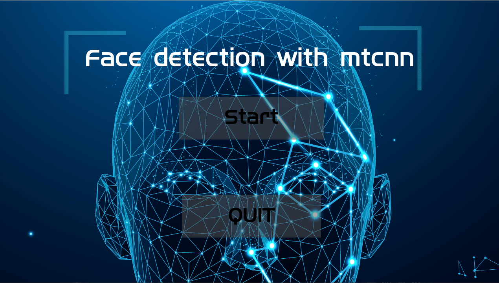

# Face Recognition basé sur MTCNN et Facenet

Ce projet vise à développer une application de reconnaissance faciale en utilisant les librairies MTCNN et Facenet. MTCNN est utilisé pour détecter les visages dans les images, tandis que Facenet est utilisé pour encoder les visages détectés en un vecteur unique qui peut être comparé à d'autres vecteurs pour effectuer la reconnaissance faciale.

 <br>
## Prérequis

Avant de pouvoir exécuter ce projet, vous devez avoir installé les packages suivants:

tensorflow
mtcnn
keras
opencv
scikit-learn
## Exécution

Pour exécuter ce projet, vous pouvez cloner ce dépôt sur votre machine locale en utilisant la commande suivante:
```
git clone https://github.com/verus56/face-recognition-based-sur-mtcnn-facenet.git
```
Une fois cloné, vous pouvez exécuter le fichier principal main.py en utilisant la commande suivante:
```
python main.py
```
L'application démarrera et vous pourrez commencer à utiliser la reconnaissance faciale en ajoutant des images de personnes à la base de données de reconnaissance faciale.

## Fonctionnement interne

Lorsque l'application démarre, elle utilise MTCNN pour détecter les visages dans les images de la base de données de reconnaissance faciale. Les visages détectés sont ensuite encodés en utilisant Facenet pour produire un vecteur unique qui représente chaque personne.

Lorsqu'une image est soumise pour la reconnaissance faciale, le même processus de détection de visage et d'encodage est effectué sur l'image soumise. Le vecteur obtenu est ensuite comparé à chaque vecteur dans la base de données de reconnaissance faciale pour trouver le visage le plus proche.

## Conclusion

Ce projet vous montre comment utiliser les librairies MTCNN et Facenet pour développer une application de reconnaissance faciale simple. Vous pouvez utiliser ce code en tant que base pour construire une application plus complexe ou l'adapter à vos besoins.

by: 
  1. HAMZAOUI Thameur
  2. OMARI Hamza
  3. HADAD SARAH
  4. ELFECIH SARAH
